# App List
> 这是一个用户辅助开发者、测试、运营、变现的工具。
> 主要功能有：
> 
> * 检索设备本地的应用
> * 展示应用的名称、图标、包名信息（主要场景在于将包名与应用名关联起来）
> * 快速打开应用设置页面
> * 快速复制包名信息
> * 快速打开应用
> * 整理应用包的内置SDK信息
> 
> [下载地址](http://192.168.100.240:2025/files/AppList/)

<!-- TOC -->
* [App List](#app-list)
  * [功能说明](#功能说明)
    * [搜索](#搜索)
    * [悬浮按钮](#悬浮按钮)
    * [列表](#列表)
    * [SDK列表](#sdk列表)
      * [筛选](#筛选)
      * [关键词](#关键词)
      * [保存](#保存)
<!-- TOC -->

## 功能说明
### 搜索

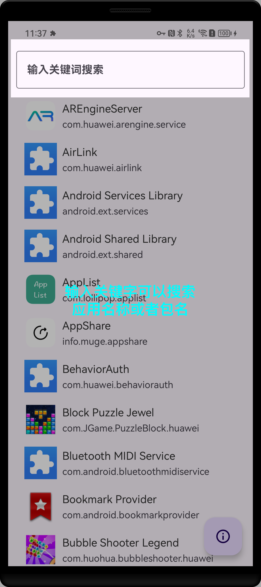
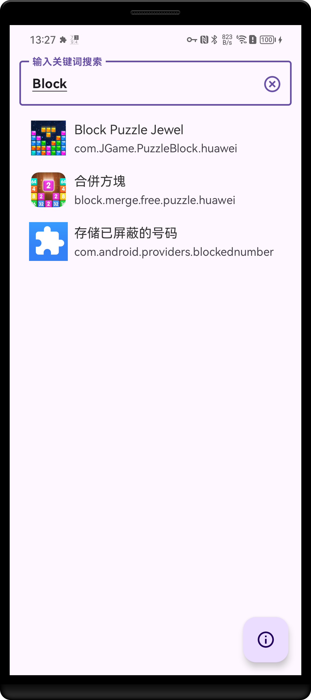

### 悬浮按钮

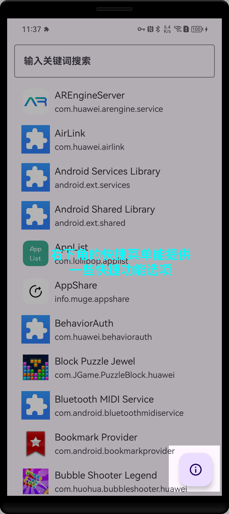

### 列表

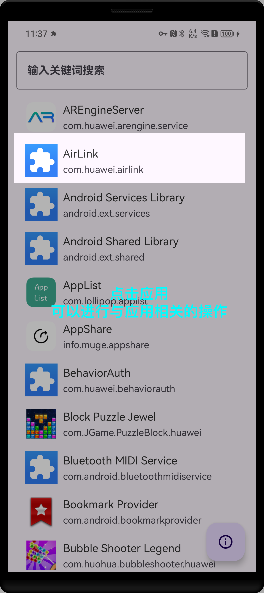
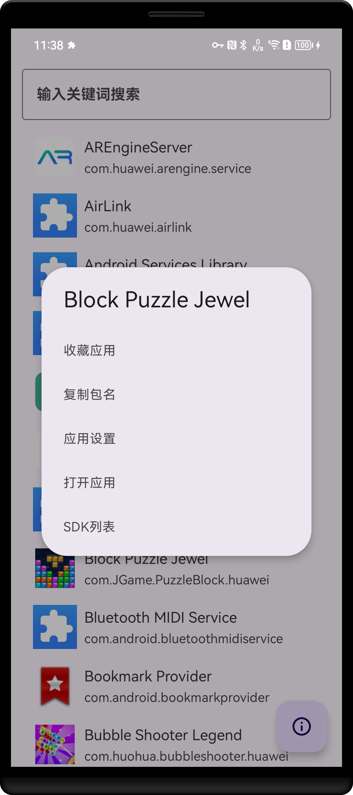

### SDK列表

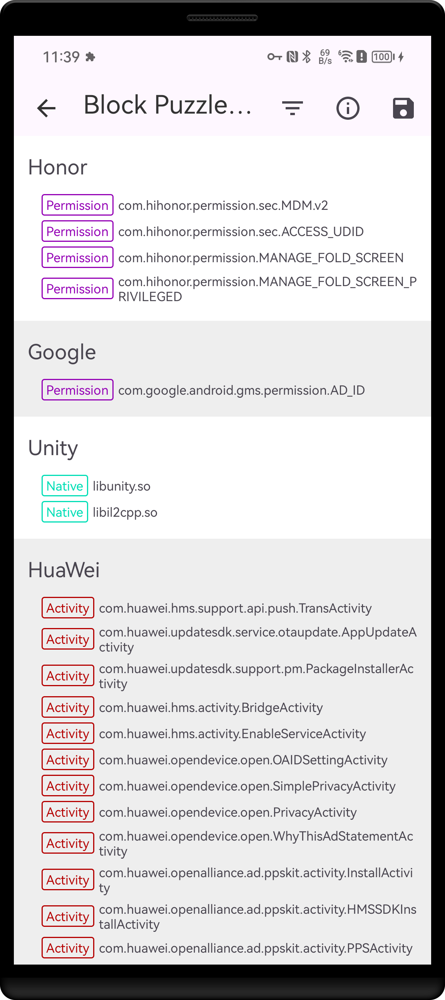

#### 筛选

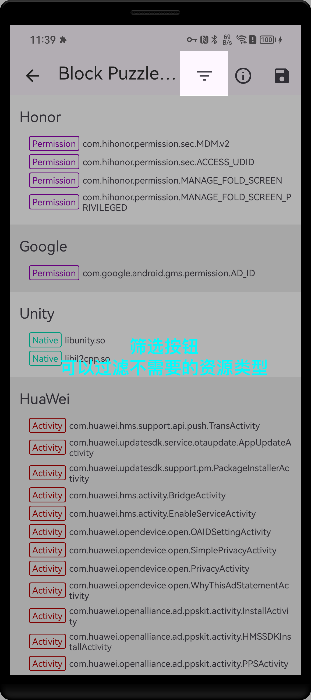
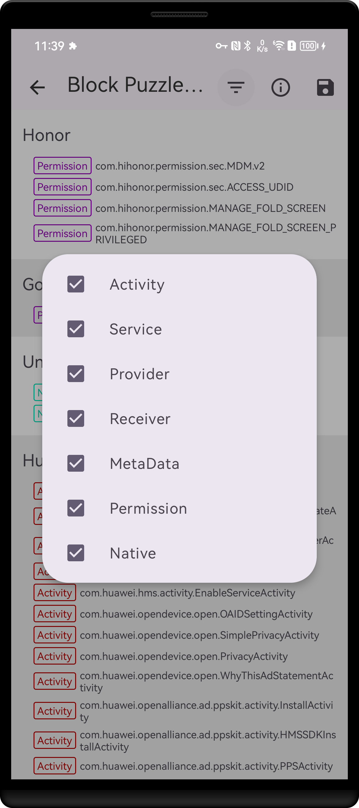

#### 关键词

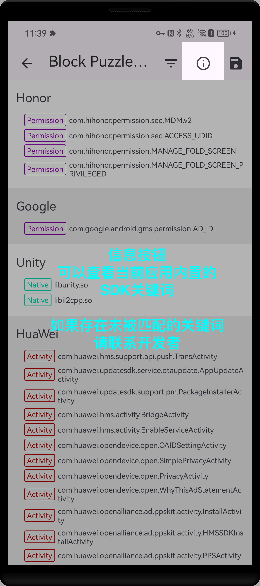
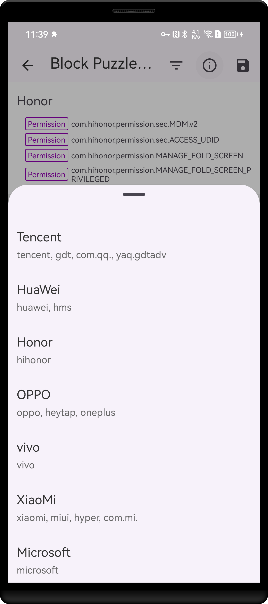

#### 保存

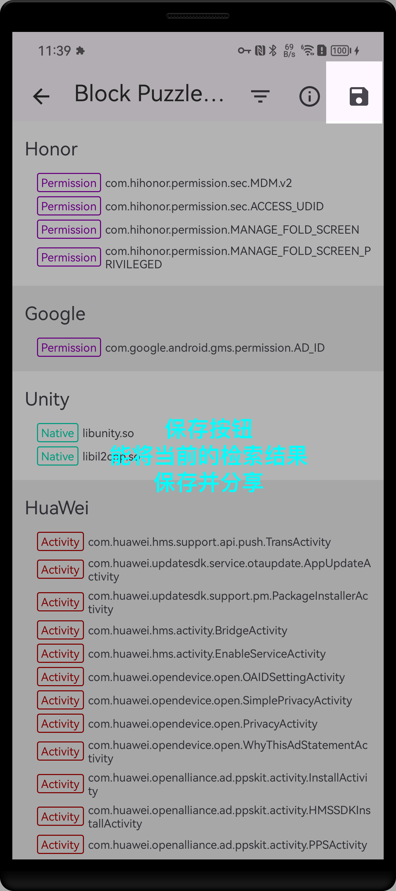

